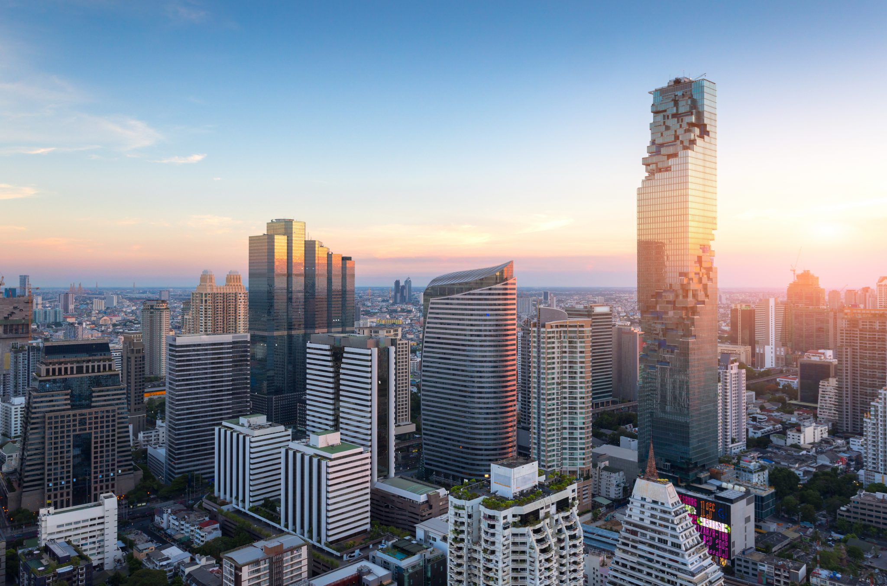
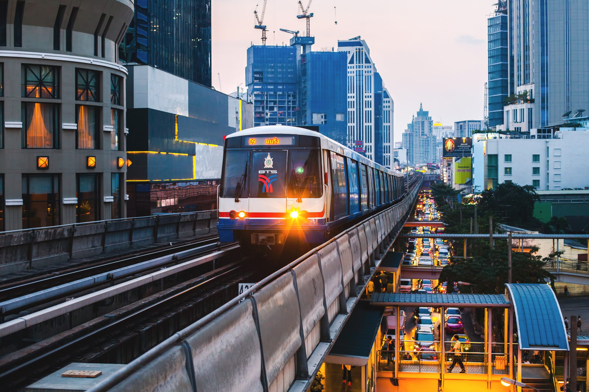

# 🚦 Transportation Mobility Factor Extraction Using AI Image Recognition

[](LICENSE)

**Author**: Teerapong Panboonyuen (Kao Panboonyuen)  
**Code**: [Transportation Mobility Factor Extraction (Code)](https://github.com/kaopanboonyuen/quality-of-life-ai-transportation)  
**Project**: [Transportation Mobility Factor Extraction (Project)](https://kaopanboonyuen.github.io/quality-of-life-ai-transportation/)  
**Publication**: [Transportation Mobility Factor Extraction Using Image Recognition Techniques](https://ieeexplore.ieee.org/document/9018796)

## 🎖️ Achievements

🏆 **2019 Best Young Researcher Paper Award**  
*First International Conference on Smart Technology & Urban Development (STUD)*

## 📄 Abstract

Urban development hinges on improving the Quality of Life (QOL) for city inhabitants. Traditionally, QOL assessments rely heavily on questionnaire surveys, which, while informative, can be costly and time-consuming. Leveraging the rapid advancements in Artificial Intelligence, this work introduces an innovative approach to automatically extract mobility indicators—key components of QOL evaluations—using **Semantic Segmentation** and **Object Recognition** techniques. Our method not only enhances the accuracy of transportation mobility assessments but also significantly reduces the data collection costs associated with QOL evaluations.

Image Reference: [bangkokgarden](https://www.bangkokgarden.com/10-things-you-need-to-know-before-moving-to-bangkok/)



---

## 🌟 Highlights

- **AI-Driven Mobility Indicator Extraction**: Uses cutting-edge image recognition techniques to derive critical mobility factors from urban environments.
- **Efficient Data Gathering**: Streamlines the process of QOL evaluation, offering a scalable and cost-effective solution.
- **Award-Winning Research**: Recognized as the Best Young Researcher Paper at STUD 2019.

## 🚀 Getting Started

### 📥 Installation

Clone the repository and install the required dependencies:

```bash
git clone https://github.com/kaopanboonyuen/quality-of-life-ai-transportation.git
cd quality-of-life-ai-transportation
pip install -r requirements.txt
```

### ⚙️ Configuration

Customize the configuration settings in `config.yaml` to match your dataset and specific needs.

### 📊 Usage

1. **Preprocessing**: Prepare your dataset using the provided preprocessing scripts.
   ```bash
   python preprocess.py --data_path /path/to/data --output_path /path/to/output
   ```
2. **Training**: Train the model with your customized settings.
   ```bash
   python train.py --config config.yaml
   ```
3. **Evaluation**: Assess the model's performance using our evaluation tools.
   ```bash
   python evaluate.py --model_path /path/to/model --test_data /path/to/test_data
   ```
4. **Inference**: Extract mobility factors from new urban images.
   ```bash
   python inference.py --image_path /path/to/image.png --output_path /path/to/output.png
   ```

### 🗂️ Project Structure

```
TransportationMobilityFactorExtraction/
│
├── data/               # Datasets and preprocessing scripts
├── models/             # Model architectures and training scripts
├── config.yaml         # Configuration file
├── train.py            # Training script
├── evaluate.py         # Evaluation script
├── inference.py        # Inference script
└── README.md           # Project documentation
```

## 📚 Publication

For more details on the research, you can read our full paper published in the *2019 First International Conference on Smart Technology & Urban Development (STUD)*:

[IEEE Xplore: Transportation Mobility Factor Extraction Using Image Recognition Techniques](https://ieeexplore.ieee.org/document/9018796)

## 🛡 License

This project is licensed under the MIT License. See the [LICENSE](LICENSE) file for details.

## 👏 Acknowledgments

This project was made possible by the contributions of our dedicated team and the support of the research community. Special thanks to the reviewers and attendees of the STUD 2019 conference for their invaluable feedback.